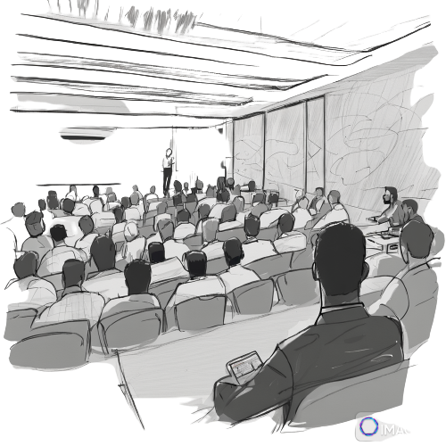

# JB's career so far
| [LinkedIn](https://www.linkedin.com/in/james-brown-6aa64923/) | [GitHub](https://github.com/JBJamesBrownJB) | [Email](<jameskinnahbrown@gmail.com>) | [Medium](https://medium.com/@jameskinnahbrown) |

`C#, Java, SQL, NoSQL, neo4j, javascript, kotlin, rust, react, vueJS, rabbitMQ, kafka, grafana, docker, terraform, event-driven, event-sorucing, CQRS,
microservices, TDD, Pairing, Trunk based development, DevSecFinOps, agility over Agile, product thinking, shift it all left`

My career has evolved in 6 parts. I believe that describing this journey along with links to examples of my work is the best way to communicate it.

<b>...I am not actively seeking other opportunities!</b>

# Part 1: High throughput, low latency, distrbuted, event driven data

I joined a sports betting tech company startup with 30 people in a warehouse in Kentish Town, and 13 years later, I left with the company having 1000+ people across global offices, having watched it float on the NY stock exchange for $1.5 billion. While coding, architecting, and leading teams, we built distributed systems processing over one hundred thousand messages a second with latencies ranging from sub-second to nanoseconds. I wrote about how I grew to learn both [mechanical and human sympathy here](https://medium.com/@jameskinnahbrown/sympathy-an-essential-ingredient-to-our-microservice-strategy-554d22f0c98e). Our data platforms were industry-leading and our agility made us one of the most competitive sports data tech companies in the world. We valued simplicity over complexity, collaboration over process, experimentation with a fail-fast/learn-early attitude, and a dedication to engineering excellence. My team's systems consistently exceeded expectations, and most of them still run today, powering the backend for many well-known sports betting platforms.

 

    TDD, Pairing, Autonomous Teams

We also built many things that, while exceptional in their engineering, nobody wanted. It was this realization that led me towards product-led engineering approaches, prompting a move to ThoughtWorks.

# Part 2: ThoughtWorks engineer

A long-time admirer of ThoughtWorks for their influence in the engineering craft and attitude towards social justice, I took the opportunity to work with some of the most humble yet brilliant engineers and leaders I have ever met. My tenure at ThoughtWorks had me coding in various languages and technologies from Java, Kotlin, Python, Rust, Terraform, React, Vue.js, and more. As a hands-on team lead, we delivered on time, exceeding expectations every time.

    TDD, Pairing,Autonomous Teams, Continuous Deployment, DORA metrics-driven, Trunk based development

You can see some of my code [here](https://github.com/JBJamesBrownJB/system-register) from a product we produced for the UK Home Office. As a team, we quickly adopted DORA metrics and achieved elite standards.

# Part 2: ThoughtWorks contributor

ThoughtWorks' vibrant community enabled me to establish an [open-source project](https://github.com/BMMRO-tech/BMMRO), crafting an application for marine scientists in the Bahamas to conduct research at sea. An initial team delivered over a million pounds of free technology using React and Firebase, facilitating devices that periodically connect to digitize their workflow. 

Now in its fourth iteration, the project continues to add value to research teams. Though I never contributed code to this project, I found my strength in delivering not just technology, but teams capable of doing the same. I began speaking at international conferences to enhance my public speaking skills, taking me to places like Morocco, [Sweden](https://youtu.be/kMWQkJ3FAxA?si=tlcfScchmebeeC-e), Norway, London, and [Milan](https://talks.codemotion.com/big-estimates-with-graph-theory?view=true). 

While I may not yet see myself as an exceptional speaker, attendees often find my talks engaging, if not entertaining.

 

# Part 4: ThoughtWorks Leader
I seized a leadership opportunity as Head of Technology for Europe's premier ed-tech company, aiming to reinvigorate its market presence. With a team of 200 developers, they hadn't launched a new product in 8 years, and they were seeing a decline in their 75% market share by 10% annually. Within a year, we launched their first new product to rave reviews. By 18 months, we had rolled out four more products, all supported by a dynamic distributed data platform that seamlessly integrated cloud and on-premise school systems in real-time. By employing ThoughtWorks' emerging Data-Mesh strategy, we brought innovative solutions that began addressing the challenges of cross-school data analytics. Our system, built on my past experiences, operated in real-time, challenging the competition's batch-based systems. When I departed, seven autonomous product-led teams, each with elite DORA metrics, were rapidly delivering new features and collaborating on a shared data strategy to form an emerging foundational internal platform, further accelerating value delivery.

    TDD, Pairing, Product-Led Autonomous Teams, Continuous Deployment, DORA metrics driven, Trunk based development, Data Mesh

 

# Part 5: The City
Taking my experience of transforming struggling technology companies I took the opportunity to practice it in a 200 year old bank, an asset management company with over $600 billion AUM, because what could be harder? Schroders are looking for an ambitious transformation of their engineering culture, organisation and approach. Joining the Enterprise team we look to steer them to a dynamic vibrant technology future...I can't talk about it much more than that as it is in-progress and sensetive.

<b>...I am not currently actively seeking other opportunities</b>

### Generate this cv as a .pdf
    cat README.md | md2pdf > JB_CV.pdf
